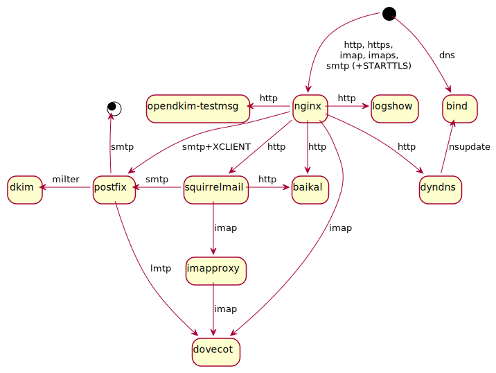

Containers
==========

How one user set them up

Picture worth 1k words
----------------------

What can you see on this picture?

* SMTP, HTTP, and HTTPS requests come to [nginx][] container - It manages all SSL stuff, including STARTTLS encryption layer for SMTP, and also serves static sites

* plaintext SMTP is forwarded to [Postfix][] server - together with XCLIENT which gives remote server information to Posfix

* Postfix uses [DKIM][] milter and forwards received emails to [dovecot][] via LMTP

* Also there are [SquirrelMail][] and [Baikal][] containers

* they have separate address books, sadly

[nginx]: nginx.cont/README.md
[Postfix]: postfix.cont/README.md
[dovecot]: dovecot.cont/README.md
[DKIM]: dkim.cont/README.md
[SquirrelMail]: squirrelmail.cont/README.md
[Baikal]: baikal.cont/README.md

Extra features
--------------

* Separate containers for SMTP security layer (ngnix) and message processing (Postfix)

* Separate containers for email processing (Postfix) and mail storage (Dovecot)

See [daily.sh][]:

* addresses listed in SquirrelMail address book are whitelisted from spam

* list of dovecot users is synced to postfix

* emails from addresses not listed in user's SquirrelMail address book are sorted directly to trash

Installation
------------

* (optionally) look through all dockerfiles and edit them to your taste

* Run `builds.sh` to build all containers

* Look through all directories, read all READMEs, edit all necessary files

* Run `starts.sh` to start all containers

* (optionally) run `docker ps -a` to confirm that all containers are running

Usage
-----

Some directories have `reload.sh` and `logrotate.sh` files to reload config files and rotate logs for relevant services.
This stuff is still in progress.

To terminate all running docker containers, run this command:

	docker ps -qa | xargs docker rm -f

Note that it will rip **all** your containers, not only those started here!
