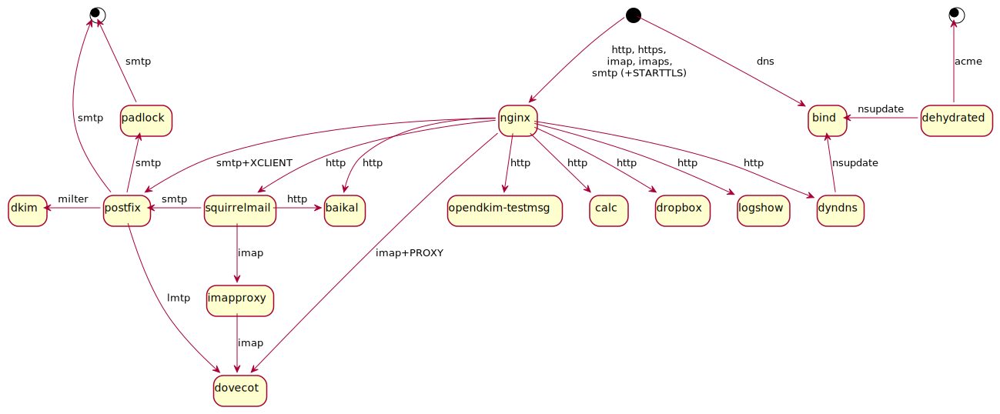

Containers
==========

How one user set them up

Intro
-----

Containers are nice:

* They force you to be careful about storing your **configuration**:
instead of modifying vendored config files in various places,
you should either "bake" your config into image
(thus, likely, documenting all changes in Dockerfile),
or expose few files/dirs to the container
(thus, likely, limiting your config to only few files).

* They are good for **portability**:
if you rented a cloud VM ~10 years ago and it's less than supported time for the OS you installed at that time,
then you have to either upgrade it to new version
(which is, well, risky),
or migrate your config to a new clean installed version,
and what did I tell you about 
modifying vendored config files in the bullet point above?

* They are good for **security**:
based on Linux security features (like chroot),
they might be not as secure as separate VMs running on the same host
(although this is questionable),
and definitely not as secure as your own physical hardware
behind a bullet-proof door,
but still better than nothing.

	After all, why let your world-exposed SMTP server access the mail you've already received?
	Or why not keep your HTTPS certificates separate from PHP scripts you downloaded from Internet,
	which might (or might not) contain vulnerabilities, PHP shells, etc?
	Or from your e-mails?

	Of course, one might say that containers are not _made for_ security,
	but I will answer that no wall is impenetrable, and extra layer of security is better than lack of it.

Picture worth 1k words
----------------------

What can you see here:

* SMTP, HTTP, and HTTPS requests come to [nginx][] container - It manages all SSL stuff, including STARTTLS encryption layer for SMTP, and also serves static sites.
Note that it's the only container exposed to Internet and having access to the SSL certificates.

* plaintext SMTP is forwarded to [Postfix][] server - together with XCLIENT which gives Postfix information about remote server.

* Postfix uses [DKIM][] milter and forwards received emails to [dovecot][] via LMTP.

* Other backend servers are [SquirrelMail][] for webmail and [Baikal][] for calendar/address book sync, both of which are implemented in plain PHP.
SquirrelMail can use [CardDav addressbook plugin][abook_carddav] to access Baikal addressbook.

* This picture was created with [PlantUML][p1].

[nginx]: nginx.cont/README.md
[Postfix]: postfix.cont/README.md
[dovecot]: dovecot.cont/README.md
[DKIM]: dkim.cont/README.md
[SquirrelMail]: squirrelmail.cont/README.md
[Baikal]: baikal.cont/README.md
[abook_carddav]: https://github.com/Lex-2008/abook_carddav
[p1]: http://www.plantuml.com/plantuml/uml/NP2nIWGn48RxUOgfbHJNBaSu40j1h2m4jOYNqHjk9hicitA-lNXht5oQGFx_-oPXTiL2jba53Xm9IIVxnaXbdtao7XF0yzKhEe_fWzDfmA8slQI3rRC050j6E8t5tla4PmwTypLPdEkdc_kxsuV7Itg3sosbw3ty1UZcrTmiQdqX7bbNJfm_9mCgYr7-fyOlse-sWixNR41fnfNFcNCcqS02xGMTzB_l-dOaQ-XhZs-1Zq46_DrGiv46gsLjUsb7ASugFm00

Extra features
--------------

* Separate containers for SMTP security layer (ngnix) and message processing (Postfix)

* Separate containers for mail processing (Postfix) and storage (Dovecot)

With periodically running [daily.sh](daily.sh):

* mail from addresses listed in SquirrelMail address books is excluded from spam check

* list of dovecot users is synced to postfix (mail to non-existing local users promptly discarded)

* mail from addresses not listed in user's SquirrelMail address book sorted directly to trash (optionally)

Installation
------------

* (optionally) look through all dockerfiles and edit them to your taste

* Run `builds.sh` to build all containers

* Look through all directories, read all READMEs, edit all necessary files,
optionally run `daily.sh` to sync configs.

* Run `starts.sh` to start all containers

* (optionally) run `docker ps -a` to confirm that all containers are running

Usage
-----

Some directories have `reload.sh` and `logrotate.sh` files to reload config files and rotate logs for relevant services.
This stuff is still in progress.

To terminate all running docker containers, run this command:

	docker ps -qa | xargs docker rm -f

Note that it will rip **all** your containers, not only those started here!
